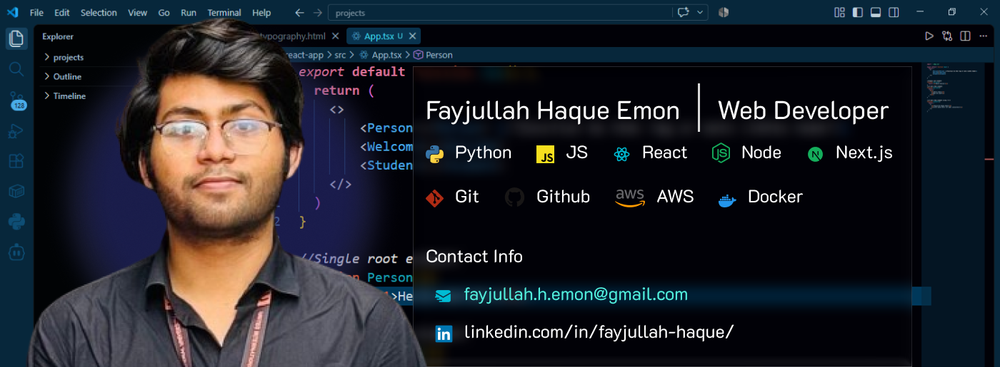
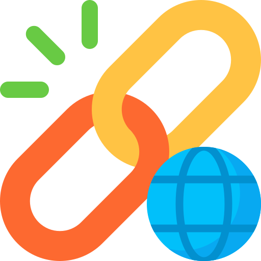

  

  

## 📌 About Me
- Hi, I'm Fayjullah Haque Emon, and completed B.Sc. in Computer Science & Engineering majoring in Data Science at United International University (UIU) in Dhaka, Bangladesh. Driven by curiosity and a solid 3.62 CGPA, I love diving into everything from AI/ML and Full-Stack Development to IoT Systems and Cloud Research. I’m also an active general member of the UIU Computer Club, and I recently had the exciting experience of placing as the 5th Runner Up at the UIU CSE Project Show 2025. I am currently open to internships and collaborations.

<!-- 

   &nbsp;
   &nbsp;
   &nbsp;
   &nbsp;
   &nbsp;
   &nbsp;
   &nbsp;
  

 -->

  
  
  
  
  
  

## 🚀 Current Endeavors & Recent Work
- ⚛️ **Frontend Mastery:** Currently expanding my expertise in **React.js** while continuously polishing my **JavaScript** fundamentals.
- 🎨 **UI/UX Design:** Actively enhancing my design skills to create intuitive user experiences. I have built several UI projects, which you can explore on my [Portfolio Website](https://fayjullah.netlify.app/#projects).
- 🛠️ **Software Quality Assurance:** Developed and deployed a live **Software Testing Tool** [Live Demo](https://fayjullahhemon-2025.github.io/Software-Testing-Tool/).
- ✍️ **Research & Publications:** Documented my academic research in an article about my thesis journey [Read Article](https://fayjullah.netlify.app/#blog).
- 🎥 **Content Creation:** Shared my learning journey by creating a YouTube tutorial explaining **JavaScript Closures** [Watch Video](https://youtu.be/ddNSZFHtuuI)

## 🧠 My Focus Areas
- 🌐 **Web Development**
- 🤖 **AI/ML Research**
- 🛡️ **SQA**
- 🎨 **UI/UX**

## 🔥 Languages & Frameworks & Tools & Abilities 

  

## 🗂️ Featured Projects

<table>
  <tr>
    <td width="50%" valign="top">
      <h3>🔬 Shelf To Tales</h3>
      
        
      
        
      <b>📝 Description:</b> 
      Shelf To Tales is a book-sharing platform designed to bridge the gap between book lovers by facilitating the temporary exchange of books within a trusted community.
        
      <b>💻 Technologies Used:</b> 
      <code>HTML</code> <code>CSS</code> <code>JavaScript</code> <code>React</code> <code>Spring Boot</code> <code>Nest.js</code> <code>PostgreSQL</code> <code>Docker</code> <code>JWT</code>
        
      <b>🧩 Problem Statement:</b> 
      There are many platforms for buying and selling books, but no platform for exchanging books. People often buy books and don't read them again. They want to exchange their books with others.
        
      <b>✅ Our Solution:</b> 
      We built a platform for exchanging books. Users can list their books, browse available titles, and connect with others to share stories, ensuring a seamless and secure lending experience.
        
      <b>👥 Team:</b> 🤝 Team Project (2 Members)
    </td>
    <td width="50%" valign="top">
      <h3>🛠️ Software Testing Tool</h3>
      
      
        
      
        
      <b>📝 Description:</b> 
      Software Testing Tool is a web application that allows users to test their software. It provides a platform for users to test their software and get feedback.
        
      <b>💻 Technologies Used:</b> 
      <code>HTML</code> <code>CSS</code> <code>JavaScript</code> <code>PHP</code>
        
      <b>🧩 Problem Statement:</b> 
      Many software testing tools are expensive and difficult to use. There is a need for a simple, affordable, and easy-to-use testing tool for both developers and non-developers.
        
      <b>✅ My Solution:</b> 
      I built a software testing tool that is simple, affordable, and easy to use. It provides a platform for users to test their software and get instant feedback.
        
      <b>👥 Team:</b> 🧑‍💻 Solo Project
    </td>
  </tr>
</table>

## 📊 GitHub Stats
<!--  
   -

 -->

<picture>
  <source
    srcset="https://github-readme-stats-fast.vercel.app/api?username=fayjullahhemon-2025&show_icons=true&theme=dark"
    media="(prefers-color-scheme: dark)"
  />
  <source
    srcset="https://github-readme-stats-fast.vercel.app/api?username=fayjullahhemon-2025&show_icons=true"
    media="(prefers-color-scheme: light), (prefers-color-scheme: no-preference)"
  />
  
</picture>

 

## 🔗 GitHub Contributions:

<picture>
  <source media="(prefers-color-scheme: dark)" srcset="https://raw.githubusercontent.com/abozanona/abozanona/output/pacman-contribution-graph-dark.svg">
  <source media="(prefers-color-scheme: light)" srcset="https://raw.githubusercontent.com/abozanona/abozanona/output/pacman-contribution-graph.svg">
  
</picture>

  

